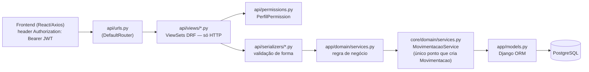
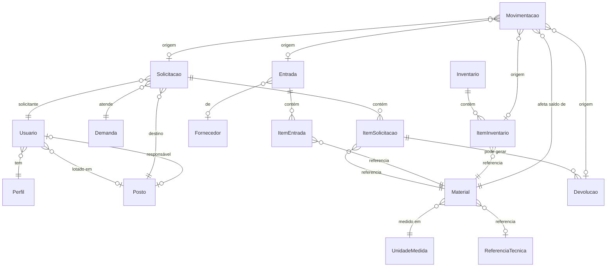
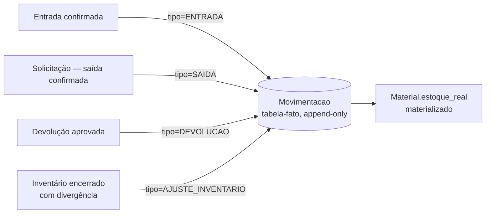
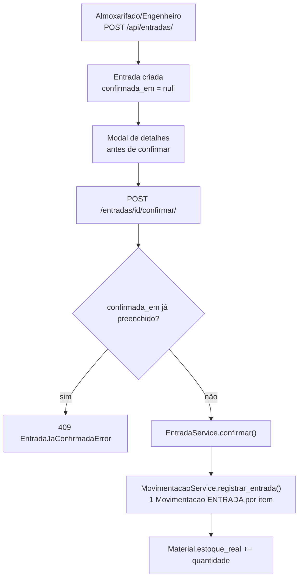
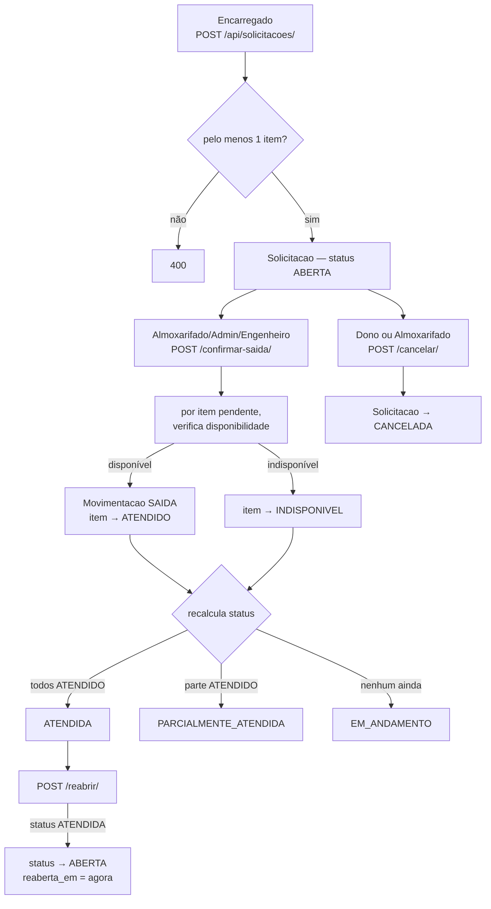
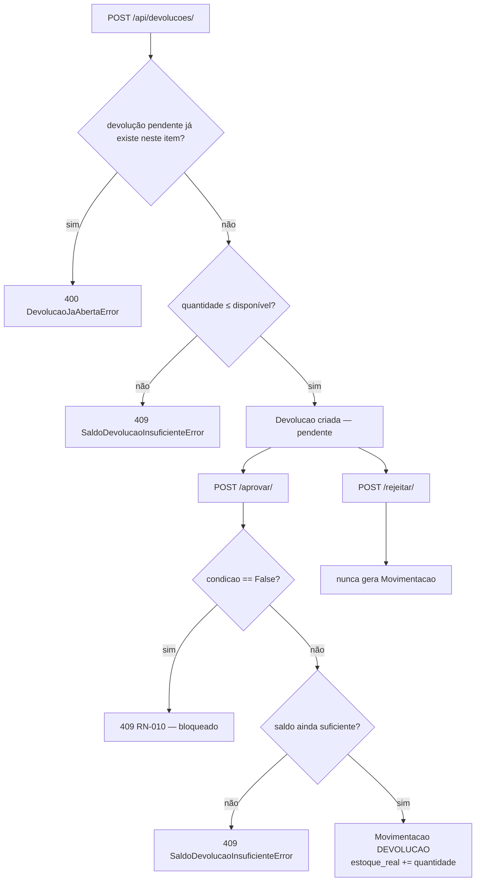
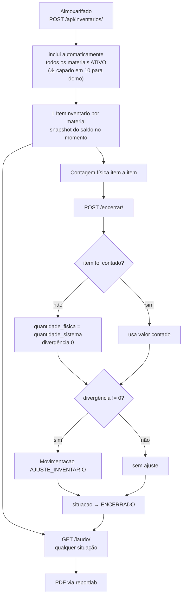
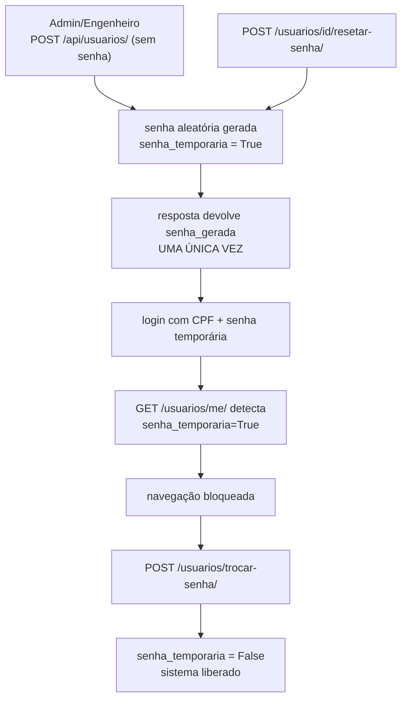

# Documentação Técnica — Sistema Engemil

**Projeto:** Engemil — Sistema de Controle de Estoque/Almoxarifado
**Versão:** MVP — Backend, Frontend e Ambiente de Demonstração
**Data de atualização:** 17 de agosto de 2026
**Responsável pela entrega:** Deborah Ohanne
**Repositórios:** `engemil` (backend) e `engemil-frontend` (frontend), branches `main`/`develop` em ambos

> Este documento substitui e atualiza o "Status de Desenvolvimento" anterior (13/08/2026), verificado linha a linha contra o estado real do código nos dois repositórios em 17/08/2026, e amplia o conteúdo para servir como documentação técnica completa da aplicação — não só um checklist de status.

---

## Índice

1. [Visão geral](#1-visão-geral)
2. [Status de desenvolvimento](#2-status-de-desenvolvimento)
3. [Arquitetura](#3-arquitetura)
4. [Modelo de dados](#4-modelo-de-dados)
5. [Perfis e permissões](#5-perfis-e-permissões)
6. [Regras de negócio críticas](#6-regras-de-negócio-críticas)
7. [Fluxos de trabalho](#7-fluxos-de-trabalho)
8. [Referência de API](#8-referência-de-api)
9. [Frontend — estrutura e padrões](#9-frontend--estrutura-e-padrões)
10. [Deploy e ambientes](#10-deploy-e-ambientes)
11. [Próximos passos técnicos](#11-próximos-passos-técnicos)
12. [Pendências de negócio](#12-pendências-de-negócio-para-reunião-com-o-cliente)
13. [Decisões técnicas fechadas](#13-decisões-técnicas-fechadas-não-reabrir-sem-necessidade)

---

## 1. Visão geral

O Engemil é um sistema de controle de estoque/almoxarifado sob medida para a empresa Engemil (setor elétrico), cobrindo o ciclo completo de um material dentro do estoque:

- **Entrada** de material (compra/recebimento) → confirmação → soma no saldo
- **Solicitação** de material por um posto/demanda → confirmação de saída → subtrai do saldo
- **Devolução** de material solicitado e não usado → aprovação/rejeição → soma de volta (se em condição de uso)
- **Inventário** físico periódico → contagem → ajuste automático de divergência

Toda alteração de saldo de estoque, qualquer que seja a origem, converge para um único registro de auditoria (`Movimentacao`), append-only, que serve tanto de fonte de verdade para o saldo atual (`Material.estoque_real`) quanto de trilha de auditoria completa.

O sistema tem controle de acesso por 6 perfis de usuário (só 3 estão com regras de negócio implementadas hoje — ver [seção 5](#5-perfis-e-permissões)), login por CPF, e senha de primeiro acesso gerada pelo sistema.

---

## 2. Status de desenvolvimento

### ✅ Concluído

**Documentação / Design**
- Modelo entidade-relacionamento (ER) fechado
- Dicionário de dados
- Modelo de classes (DDD: Aggregates, Value Objects, Domain Services)
- Documento de arquitetura ART-04 (Django+DRF, JWT, apps por bounded context)
- Documentação técnica interna viva nos dois repositórios (`ARCHITECTURE.md`, `BUSINESS_RULES.md`, `FLUXOS.md`, `STATE.md`, `TODO.md`) — mantida a cada sessão de desenvolvimento

**Ambiente**
- Python 3.12.7 via pyenv (**nunca** 3.14 — incompatível com Django 5.0.6)
- Django 5.0.6 + dependências fixadas em `requirements.txt`
- PostgreSQL 16 local via Docker (`engemil-db`)
- `config/settings/` dividido em `base.py`/`development.py`/`production.py`
- `django-environ` configurado — `.env` protegido no `.gitignore`
- Node.js 22 + Vite + React + TypeScript para o frontend

**Backend — App `core`**
- `Perfil`, `Posto`, `Usuario` (Custom User Model), `UnidadeMedida`, `ReferenciaTecnica`, `Fornecedor`, `Demanda`, `Material`, `Movimentacao` — models completos
- `AUTH_USER_MODEL = core.Usuario`, login por CPF (`USERNAME_FIELD = 'cpf'`)
- `core/domain/`: `OrigemMovimentacao` (Value Object) + `MovimentacaoService` + `SaldoEstoqueService`
- `UsuarioCreateSerializer` com senha aleatória gerada via `create_user()` (nunca aceita senha do cliente)
- Migrations geradas e aplicadas; banco de dev/prod zerado e recriado do zero nesta sessão (sem dívida de migration pendente)

**Backend — Apps de domínio (`solicitacoes`, `entradas`, `devolucoes`, `inventario`)**
- Todos os 4 apps com `models.py` + `domain/services.py` completos
- `SolicitacaoService` — `confirmar_saida` (atendimento parcial), `verificar_disponibilidade`, `cancelar`, `reabrir` (novo)
- `EntradaService` — `confirmar`, protegido contra dupla confirmação (`confirmada_em` + `EntradaJaConfirmadaError`)
- `DevolucaoService` — `informar`/`aprovar`/`rejeitar`, com bloqueio RN-010 e proteção contra devolução duplicada/saldo insuficiente em duas camadas (novo)
- `InventarioService` — `iniciar`/`registrar_contagem_fisica`/`encerrar`, reformulado nesta sessão (ver abaixo)

**Backend — Camada `api/`**
- `permissions.py` — `PerfilPermission` (com `funcoes_somente_leitura`), `ApenasProprioSolicitante`, `ApenasDevolucaoDoProprioSolicitante` — **matriz de permissões fechada e implementada** para os 4 perfis com regra definida
- `serializers/` — todos os domínios, padrão leitura + criação separados, `validate()` espelhando os `CheckConstraint` do banco
- `views/` — todas as actions de negócio, incluindo as novas: `cancelar`, `reabrir` (Solicitação), `laudo` (Inventário, PDF)
- `urls.py` com `DefaultRouter` + JWT (`auth/token/`, `auth/token/refresh/`)
- `django-cors-headers`, `django-filter`, paginação configurados
- **Busca e filtro em praticamente todos os endpoints de listagem** (concluído nesta sessão — ver [seção 8](#8-referência-de-api))
- `MovimentacaoSerializer` ganhou `usuario_nome`; `select_related` aplicado para evitar N+1

**Backend — Dados e ferramentas**
- `seed_inicial` — popula os 6 perfis + 2 usuários administradores de demonstração
- `seed_teste_perfis` — 4 usuários de teste (1 por perfil ativo) + Posto/Demanda de teste; roda em produção também (ambiente de deploy é MVP/demonstração)
- `importar_materiais` — 978 materiais reais da Engemil importados de planilha Excel (idempotente, `--dry-run` disponível)
- `seed_demo` (**novo**) — dados ricos de demonstração via services de domínio (não inserts crus): fornecedores, entradas, solicitações e devoluções em vários estados, inventários em andamento e encerrado com divergência
- Roteiro de teste manual da API documentado, cobrindo os fluxos de ponta a ponta

**Backend — Inventário (retrabalho completo nesta sessão)**
- `iniciar()` não recebe mais lista de materiais — inclui automaticamente todos os materiais `ATIVO` (⚠️ temporariamente limitado aos 10 primeiros para a demonstração, ver [seção 11](#11-próximos-passos-técnicos))
- `encerrar()` não bloqueia mais esperando 100% dos itens contados — item não contado recebe `quantidade_fisica = quantidade_sistema` automaticamente
- Laudo em PDF: `GET /api/inventarios/<id>/laudo/`, gerado com `reportlab`, logo da Engemil + tabela completa de itens, paginação automática

**Frontend**
- React 19 + TypeScript + Vite + React Router 7 + TanStack Query + Axios + Ant Design 6 (ver nota de versão em [seção 3](#stack))
- Autenticação JWT completa (login por CPF com máscara, logout, rota protegida, bloqueio de primeiro acesso)
- Layout principal (sidebar + header) com identidade visual do cliente (ver [seção 9](#identidade-visual))
- 6 telas de listagem com dado real (Materiais, Solicitações, Entradas, Devoluções, Inventário, Movimentações), todas com busca/filtro
- Formulários de criação com `Form.List` de itens dinâmicos (Solicitação, Entrada)
- Actions de negócio completas: Confirmar Saída, Cancelar e Reabrir Solicitação; Confirmar Entrada (com modal de conferência); Informar, Aprovar e Rejeitar Devolução; Iniciar, contar e Encerrar Inventário; download de laudo em PDF
- Cadastros completos (listar/criar/editar): Unidade de Medida, Fornecedor, Posto, Demanda, Perfil, Usuário (+ resetar senha)
- Dashboard inicial com 5 indicadores resumidos
- Componente `NumeroTabela` (fonte monoespaçada) aplicado nas colunas numéricas
- Tratamento de erro robusto (`extrairMensagemErro`, com guard contra resposta HTML não-JSON)

**Deploy — Ambiente de Demonstração**
- Backend hospedado no Render (`https://engemil.onrender.com`), com PostgreSQL gratuito
- Frontend hospedado no Render como Static Site
- `build.sh` automatiza `pip install`, `collectstatic`, `migrate`, `seed_inicial`, `seed_teste_perfis`, `importar_materiais`, `seed_demo` a cada deploy
- WhiteNoise servindo arquivos estáticos em produção; Gunicorn como servidor WSGI
- Versão do Python fixada via `.python-version` (padrão correto do Render)
- JWT com validade estendida (8h access / 7 dias refresh) para não expirar durante demonstrações

### 🔧 Corrigido nesta sessão (bugs reais)

| Bug | Causa | Correção |
|---|---|---|
| Aprovar devolução podia estourar `500` cru | `aprovar()` não revalidava saldo disponível — uma segunda devolução do mesmo item podia violar constraint do banco | `SaldoDevolucaoInsuficienteError` validado também em `aprovar()`, não só na criação |
| Duas devoluções pendentes do mesmo item ao mesmo tempo | Nenhuma trava de concorrência | `DevolucaoJaAbertaError` — só uma devolução em aberto por item por vez |
| Erro genérico `"<"` no frontend em respostas não-JSON | Resposta HTML de erro sendo iterada como objeto | Guard `typeof dados !== 'object'` em `extrairMensagemErro` |
| Encarregado via botão "Confirmar Saída" mesmo sem permissão | Backend já bloqueava (`403`), frontend não escondia o botão | Botão só renderiza para o grupo de perfis correto |
| `loading` acendia em todas as linhas da tabela ao salvar uma contagem | `mutation.isPending` sozinho não distingue qual item está sendo salvo | Comparação por ID do item em processamento |
| Código de material longo atropelava coluna no PDF do laudo | Texto simples não quebra linha em `Table` do reportlab | Texto envolvido em `Paragraph` |

### 📌 Estado do git (17/08/2026)

- **Backend**: `develop` sincronizado com `origin/develop` (nada pendente de push). 3 commits em `develop` ainda não mesclados em `main`.
- **Frontend**: `develop` sincronizado com `origin/develop`. 18 commits em `develop` ainda não mesclados em `main`. Há alterações **não commitadas** localmente: nova paleta de cores do cliente (`theme.ts` + remoção de hex hardcoded em ~10 páginas) — ver [seção 9](#identidade-visual).
- O ambiente de demonstração no Render normalmente reflete `main`; portanto o deploy público pode estar **atrás** do que está em `develop` até o próximo merge — checar antes de apresentar ao cliente.

---

## 3. Arquitetura

### Stack

| Camada | Tecnologia | Versão confirmada |
|---|---|---|
| Backend | Django | 5.0.6 |
| | Django REST Framework | 3.15.1 |
| | djangorestframework-simplejwt | 5.3.1 |
| | django-filter | 24.2 |
| | PostgreSQL | 16 |
| | Python (via pyenv) | 3.12.7 — **nunca 3.14** |
| | reportlab (laudo PDF) | 5.0.0 |
| | Servidor WSGI | Gunicorn 22.0.0 + WhiteNoise 6.7.0 |
| Frontend | React | **19.2.8** |
| | TypeScript | ~6.0.2 |
| | Vite | 8.2.1 |
| | React Router | **7.18.2** |
| | Ant Design | **6.6.0** |
| | TanStack Query (React Query) | 5.101.4 |
| | Axios | 1.19.0 |
| Deploy | Render.com | Web Service (backend) + Static Site (frontend), sem Docker |

> **Nota de correção**: a documentação técnica interna do frontend registrava React 18 / Ant Design 5 como stack — desatualizado. O `package-lock.json` confirma React 19.2.8, Ant Design 6.6.0 e React Router 7.18.2 de fato instalados e em uso.

### Fluxo de dados (ponta a ponta)



**Regra inegociável**: nenhuma alteração de saldo de estoque acontece fora de `MovimentacaoService`. Todo app de domínio delega a ele.

### Árvore do projeto — backend

```
engemil/
├── manage.py
├── requirements.txt
├── build.sh                          # roda no deploy do Render
├── .python-version                   # "3.12.7"
├── data/Lista_de_materiais_Engemil.xlsx
├── config/
│   ├── settings/{base,development,production}.py
│   ├── urls.py / wsgi.py / asgi.py
├── core/                              # bounded context central — nunca importa dos outros apps
│   ├── models.py                     # Perfil, Posto, Usuario, UnidadeMedida, ReferenciaTecnica,
│   │                                   Fornecedor, Demanda, Material, Movimentacao
│   ├── validators.py                 # validar_cpf, validar_telefone, validar_quantidade_por_unidade
│   ├── domain/
│   │   ├── value_objects.py          # OrigemMovimentacao
│   │   └── services.py               # MovimentacaoService, SaldoEstoqueService
│   ├── management/commands/          # seed_inicial, seed_teste_perfis, importar_materiais, seed_demo
│   └── admin.py                      # só core registrado no Django Admin
├── solicitacoes/    (models.py + domain/services.py — SolicitacaoService)
├── entradas/        (models.py + domain/services.py — EntradaService)
├── devolucoes/      (models.py + domain/services.py — DevolucaoService)
├── inventario/      (models.py + domain/services.py + domain/relatorio.py — InventarioService, PDF)
└── api/                               # única camada HTTP
    ├── permissions.py
    ├── urls.py
    ├── serializers/{core,solicitacoes,entradas,devolucoes,inventario}.py
    └── views/{core,solicitacoes,entradas,devolucoes,inventario}.py
```

### Árvore do projeto — frontend

```
engemil-frontend/
├── index.html
├── src/
│   ├── main.tsx / App.tsx / routes.tsx / theme.ts
│   ├── types/            # singular — interfaces TS espelhando serializers DRF
│   ├── api/               # plural — funções axios por domínio
│   ├── hooks/             # useUsuarioAtual, useDebouncedValue
│   ├── access/            # acessoPorFuncao.ts — matriz área → perfis, espelha o backend
│   ├── components/        # ProtectedRoute, RequireSenhaAtualizada, RequireFuncao, NumeroTabela, SenhaGeradaModal
│   ├── layouts/           # MainLayout
│   ├── utils/             # formatarData, unidadesContaveis, formatarMoeda, statusLabels, extrairErro
│   └── pages/
│       ├── Login.tsx, DashboardPage.tsx, TrocarSenhaObrigatoria.tsx
│       ├── materiais/, solicitacoes/, entradas/, devolucoes/, inventario/, movimentacoes/
│       └── cadastros/{unidadesMedida,fornecedores,postos,demandas,perfis,usuarios}/
```

### Padrões e regras de arquitetura (backend — não reabrir sem necessidade)

1. Domínio vive em `<app>/domain/services.py`, separado de `models.py` — separação pragmática, não é Clean Architecture total
2. `core` nunca importa dos outros apps de domínio; eles importam de `core`
3. FK entre apps via string (`'app.Model'`) — evita import circular em Python
4. Toda regra de negócio que existe como `CheckConstraint` no banco precisa de `validate()` espelhado no serializer correspondente — sem isso, violação de constraint vira `500` cru em vez de `400` com mensagem
5. `UniqueConstraint` composta (multi-campo) não é validada automaticamente pelo DRF — precisa de `validate_itens()` customizado
6. Padrão de serializer: um para leitura, outro para criação (`XSerializer`/`XCreateSerializer`), escolhido via `get_serializer_class()`
7. Ações de mutação usam DRF `@action`
8. Senhas: nunca aceitar `password` bruto — sempre via `Usuario.objects.create_user()`/`set_password()`
9. Escopo por perfil em `get_queryset()` (o quê vê) é distinto de `funcoes_permitidas` (se acessa)
10. `funcoes_somente_leitura` libera leitura de recursos de apoio sem liberar a gestão deles
11. Permissão de objeto individual (`ApenasProprioSolicitante` etc.) sempre em conjunto com o filtro equivalente em `get_queryset()`
12. Saldo materializado: valor lido com frequência mas caro de calcular é materializado num campo mantido pelo único service autorizado a escrevê-lo, na mesma transação do evento de origem (`Material.estoque_real`)

---

## 4. Modelo de dados

### `core` — entidades de apoio e transversais

| Entidade | Campos-chave | Observações |
|---|---|---|
| `Perfil` | `nome`, `funcao` (única) | `funcao` é a chave de negócio usada nas regras de permissão |
| `Posto` | `codigo` (único), `nome`, `responsavel` (FK `Usuario`, nullable) | `responsavel` (quem responde pelo posto) é **distinto** de `Usuario.posto` (lotação) |
| `Usuario` | `cpf` (único, login), `nome`, `sobrenome`, `email`, `senha_temporaria`, `situacao`, `perfil` (FK), `posto` (FK, nullable) | `AUTH_USER_MODEL`. `is_active` é `@property` derivada de `situacao`, não coluna própria |
| `UnidadeMedida` | `sigla` (única), `descricao` | Contáveis: `un`, `pct`, `cx`; contínuas: `m`, `m2`, `m3`, `cm2`, `cm3`, `kg` |
| `ReferenciaTecnica` | `codigo` (única), `nome` | |
| `Fornecedor` | `nome`, `cnpj` (único), `telefone`, `email` | Validação de CNPJ ainda **não implementada** (só formato) |
| `Demanda` | `numero` (único), `descricao`, `origem`, `prazo`, `situacao` | |
| `Material` | `codigo` (único), `descricao` (único campo que nomeia o item), `unidade` (FK), `estoque_minimo` (opcional), `valor_unitario` (preço cadastral, opcional), `estoque_real` (materializado, somente leitura), `situacao` | `estoque_real` é mantido **só** por `MovimentacaoService`. Falta `categoria`/`localizacao` (pendência de negócio) |
| `Movimentacao` | `material` (FK), 4 FKs de origem (`solicitacao`/`entrada`/`devolucao`/`item_inventario`, todas nullable, **exatamente 1 preenchida**), `usuario`, `tipo`, `quantidade_anterior/posterior` (unidades físicas), `saldo_anterior/posterior` (R$) | Tabela-fato de auditoria, append-only. Regra de origem única validada em Python (`OrigemMovimentacao`) **e** `CheckConstraint` no banco |

### `solicitacoes`

| Entidade | Campos-chave | Observações |
|---|---|---|
| `Solicitacao` | `numero` (único), `status` (5 estados), `data_solicitacao`, `data_prevista` (opcional, auto-preenchida), `demanda`/`posto`/`solicitante` (FK), `reaberta_em` (nullable) | Status: `ABERTA`, `EM_ANDAMENTO`, `PARCIALMENTE_ATENDIDA`, `ATENDIDA`, `CANCELADA` — não existe status `REABERTA` (decisão consciente) |
| `ItemSolicitacao` | `solicitacao`/`material` (FK, único juntos), `quantidade_solicitada`, `quantidade_atendida`, `quantidade_devolvida`, `status`, `observacao` (obrigatória na criação via API) | Status: `PENDENTE`, `DISPONIVEL`, `INDISPONIVEL`, `ATENDIDO`, `CANCELADO`. Quantidades atendida/devolvida são campos derivados, nunca fonte de verdade |

### `entradas`

| Entidade | Campos-chave | Observações |
|---|---|---|
| `Entrada` | `fornecedor` (FK, nullable), `responsavel` (FK), `nota_fiscal`, `data_entrada`, `confirmada_em` (nullable) | `confirmada_em` protege contra dupla confirmação |
| `ItemEntrada` | `entrada`/`material` (FK), `quantidade`, `valor_unitario`, `valor_total` | `valor_total` sempre calculado no `save()`, nunca aceito como input |

### `devolucoes`

| Entidade | Campos-chave | Observações |
|---|---|---|
| `Devolucao` | `item_solicitacao` (FK), `responsavel_conferencia` (FK), `quantidade`, `condicao` (bool), `decisao` (bool), `data_inicial`, `data_final` (nullable) | Estado de 3 posições sem enum: `data_final IS NULL` = pendente; `decisao` só vale depois de `data_final` preenchido |

### `inventario`

| Entidade | Campos-chave | Observações |
|---|---|---|
| `Inventario` | `data_inicio`, `data_fim`, `encerrado_em`/`encerrado_por` (nullable), `situacao`, `observacao` | Situação: `EM_ANDAMENTO`, `ENCERRADO`, `CANCELADO`. `CheckConstraint` garante que `encerrado_em`/`encerrado_por` só existem junto de `ENCERRADO` |
| `ParticipanteInventario` | `inventario`/`usuario` (único juntos), `funcao` | |
| `ItemInventario` | `inventario`/`material` (único juntos), `saldo_sistema` (R$), `quantidade_sistema`, `quantidade_fisica` (nullable = não contado), `divergencia`, `ajuste`, `observacao` | Snapshot do saldo/quantidade no momento do início do inventário — não recalcula depois |

### Diagrama de relacionamento (visão simplificada)



---

## 5. Perfis e permissões

### Perfis (`core.Perfil.funcao`)

6 perfis fixos: `ENCARREGADO` (PER-01), `ALMOXARIFADO` (PER-02), `COMPRAS` (PER-03), `ENGENHEIRO` (PER-04), `ADMINISTRADOR` (PER-05), `CONSULTA` (PER-06).

- **`ADMINISTRADOR` e `ENGENHEIRO` têm acesso irrestrito a tudo** — confirmado pelo cliente (`Funcao.SEMPRE_PERMITIDOS`)
- **Só `ADMINISTRADOR`/`ENGENHEIRO` podem criar/gerenciar usuários**
- **Login é por CPF**, nunca e-mail nem `nome.sobrenome` (descartado por risco de colisão entre homônimos)
- **Todo usuário novo recebe senha aleatória gerada pelo sistema**, mostrada uma única vez, nunca recuperável depois
- **Usuário com senha temporária é bloqueado de usar o sistema até trocar a senha**
- `COMPRAS` e `CONSULTA` ficam **sem nenhum acesso** até terem definição própria com o cliente — pendência de negócio

### Matriz de acesso — fechada e implementada

| Área | Admin/Engenheiro | Almoxarifado | Encarregado |
|---|---|---|---|
| Materiais | ver+criar+editar | ver+criar+editar (todos) | **ver (só leitura)** |
| Solicitações | ver+criar+editar (todas) | ver+criar+editar (todas) | ver+criar+editar — **só as que ele criou** |
| Entradas | ver+criar+editar | ver+criar+editar (todas) | ❌ sem acesso |
| Devoluções | ver+criar+editar (todas) | ver+criar+editar (todas) | ver+criar+editar — **só ligadas às solicitações dele** |
| Inventário | ver+criar+editar | ver+criar+editar (todas) | ❌ sem acesso |
| Movimentações | ver (todas, só leitura) | ver (todas, só leitura) | ver (só leitura) — **só SAÍDA/DEVOLUÇÃO originadas dele** |
| Cadastros (Fornecedor/Posto/Demanda/UnidadeMedida/ReferenciaTecnica/Perfil/Usuário) | ver+criar+editar | ❌ sem acesso à aba; **leitura liberada** nos recursos que suas telas precisam | ❌ sem acesso à aba; leitura liberada só em Demanda+Posto |

Implementado em `api/permissions.py` e espelhado no frontend em `src/access/acessoPorFuncao.ts` (mesma fonte de verdade para menu e bloqueio de rota).

**Escopo do Encarregado é individual** (`solicitante = request.user`), não por posto — cada usuário pertence a um único posto e é responsável só por ele.

---

## 6. Regras de negócio críticas

| Regra | Descrição | Implementação |
|---|---|---|
| **RN-002** | Solicitação precisa de pelo menos 1 item | `SolicitacaoCreateSerializer.validate_itens()` |
| **RN-006/RN-007** | `Movimentacao` é append-only — nunca editada/excluída, erro se corrige com movimentação compensatória | Convenção de código, reforçada por FK `on_delete=PROTECT` |
| **RN-010** | Material danificado nunca retorna ao estoque | `DevolucaoService.aprovar()` levanta `MaterialDanificadoNaoRetornaAoEstoqueError` se `condicao=False`; único caminho é `rejeitar()` |
| **RN-011** | Não pode sair mais que o saldo disponível | `MovimentacaoService` levanta `SaldoInsuficienteError`; checagem em unidades físicas, não em R$ |
| Atendimento parcial | Item sem estoque fica `INDISPONIVEL` sem bloquear os demais itens da solicitação | `confirmar_saida()` processa item a item, atômico só para o lote elegível |
| Confirmação de Entrada protegida | Confirmar duas vezes não duplica movimentação | `confirmada_em` (nullable) + `EntradaJaConfirmadaError` (`409`) |
| Quantidade inteira por unidade contável | `un`/`pct`/`cx` só aceitam inteiro; `m`/`m2`/`m3`/`cm2`/`cm3`/`kg` aceitam fração | `validar_quantidade_por_unidade`, aplicado em todo serializer que recebe quantidade ligada a material. **Gap conhecido**: Django Admin não passa pelos serializers, então não valida isso |
| Custeio de saída — placeholder | `MovimentacaoService._custo_unitario_estimado()` usa "custo da última entrada" — **não é** CMP nem FIFO, decisão pendente do cliente | Isolado num único método para facilitar troca futura. Não confundir com `Material.valor_unitario` (preço cadastral, para exibição, sem relação com custeio) |
| Só uma devolução pendente por item | Nova devolução recusada se já existe uma com `data_final IS NULL` | `DevolucaoJaAbertaError` (`400`) |
| Quantidade devolvida ≤ disponível | `disponível = quantidade_atendida - quantidade_devolvida`, recalculado no submit, validado em **duas** pontas (`informar()` e `aprovar()`) | `SaldoDevolucaoInsuficienteError` (`409`) |
| Reabertura de Solicitação | Só `ATENDIDA` pode ser reaberta; volta para `ABERTA` (sem status `REABERTA` novo), grava `reaberta_em` | `SolicitacaoService.reabrir()`; `SolicitacaoNaoPodeSerReabertaError` (`409`) senão |

---

## 7. Fluxos de trabalho

### Visão geral — tudo converge para `Movimentacao`



### Entrada de material



### Solicitação → Saída (criar, confirmar, cancelar, reabrir)



### Devolução



### Inventário (iniciar, contar, encerrar, laudo)



### Criação de usuário + primeiro acesso / reset de senha



---

## 8. Referência de API

Base: `/api/`. Autenticação via header `Authorization: Bearer <access_token>`.

### Autenticação

| Método | Endpoint | Descrição |
|---|---|---|
| POST | `/auth/token/` | Login — recebe CPF+senha, devolve `access`/`refresh` |
| POST | `/auth/token/refresh/` | Renova o `access token` a partir do `refresh` |

### CRUD padrão (via `DefaultRouter`)

Todos suportam `GET` (list/retrieve), `POST`, `PATCH`, `DELETE` conforme a permissão do perfil, paginação (`{count, next, previous, results}`) e, na maioria, `?search=` e filtros por campo:

`materiais`, `unidades-medida`, `referencias-tecnicas`, `fornecedores`, `demandas`, `postos`, `usuarios`, `perfis`, `movimentacoes` (**só leitura**), `solicitacoes`, `entradas`, `devolucoes`, `inventarios`, `itens-inventario`

### Actions de negócio (`@action`)

| Método | Endpoint | Descrição |
|---|---|---|
| GET | `/usuarios/me/` | Dados do usuário autenticado |
| POST | `/usuarios/trocar-senha/` | Troca a própria senha (`senha_atual` + `nova_senha`) |
| POST | `/usuarios/<id>/resetar-senha/` | Admin/Engenheiro gera nova senha temporária para outro usuário |
| POST | `/entradas/<id>/confirmar/` | Confirma entrada, gera `Movimentacao` |
| GET | `/solicitacoes/<id>/disponibilidade/` | Verifica disponibilidade de estoque dos itens |
| POST | `/solicitacoes/<id>/confirmar-saida/` | Confirma saída (atendimento total ou parcial) |
| POST | `/solicitacoes/<id>/cancelar/` | Cancela solicitação (`ABERTA`/`EM_ANDAMENTO`/`PARCIALMENTE_ATENDIDA`) |
| POST | `/solicitacoes/<id>/reabrir/` | Reabre solicitação `ATENDIDA` |
| POST | `/devolucoes/<id>/aprovar/` | Aprova devolução, gera `Movimentacao` (se em condição de uso) |
| POST | `/devolucoes/<id>/rejeitar/` | Rejeita devolução, nunca gera `Movimentacao` |
| POST | `/inventarios/<id>/participantes/` | Adiciona participante ao inventário |
| POST | `/inventarios/<id>/encerrar/` | Encerra inventário, gera ajustes de divergência |
| GET | `/inventarios/<id>/laudo/` | Gera e baixa laudo em PDF |
| POST | `/itens-inventario/<id>/contagem-fisica/` | Registra contagem física de um item |

### Filtros de busca implementados

| Endpoint | Parâmetros |
|---|---|
| `materiais` | `?search=` (código/descrição/fabricante), `?situacao=`, `?unidade=` |
| `solicitacoes` | `?search=` (número), `?status=`, `?posto=`, `?demanda=` |
| `entradas` | `?search=` (nota fiscal), `?fornecedor=`, `?confirmada=true\|false` |
| `devolucoes` | `?search=` (código/descrição do material), `?pendente=true\|false`, `?condicao=` |
| `inventarios` | `?situacao=` |
| `movimentacoes` | `?search=` (código/descrição do material) |
| `unidades-medida`, `referencias-tecnicas`, `fornecedores`, `postos`, `demandas` | `?search=`, `?situacao=` (onde aplicável) |
| `usuarios` | `?search=`, `?situacao=`, `?perfil=` |

---

## 9. Frontend — estrutura e padrões

### Rotas

```
/login                                          [público]
/  (ProtectedRoute)
  → RequireSenhaAtualizada
    → MainLayout
      → /                                        [Dashboard, sem guard extra]
      → RequireFuncao area="materiais"     → /materiais
      → RequireFuncao area="solicitacoes"  → /solicitacoes
      → RequireFuncao area="entradas"      → /entradas
      → RequireFuncao area="devolucoes"    → /devolucoes
      → RequireFuncao area="inventario"    → /inventario
      → RequireFuncao area="movimentacoes" → /movimentacoes
      → RequireFuncao area="cadastros"     → /cadastros/*
```

Quatro camadas de guarda: `ProtectedRoute` (está logado?) → `RequireSenhaAtualizada` (já trocou a senha obrigatória?) → `MainLayout` → `RequireFuncao` (o perfil tem acesso a essa área?). `ADMINISTRADOR`/`ENGENHEIRO` sempre passam.

### Padrões de código estabelecidos

- **Leitura**: `useQuery({ queryKey, queryFn })` + `data?.results` (a API sempre pagina)
- **Escrita (criar/editar unificado)**: modal recebe prop opcional `XParaEditar`, `mutationFn` escolhe `criarX`/`editarX` via ternário
- **Ação irreversível sem formulário**: `useMutation` disparada por botão/`Popconfirm`
- **Ações concorrentes na mesma tabela**: nunca usar `mutation.isPending` direto no `loading` de um botão de linha — comparar por ID do item em processamento (bug real já corrigido)
- **Quantidade por unidade**: `ehUnidadeContavel()`/`formatarQuantidade()` de `unidadesContaveis.ts`, espelhando a regra do backend (`un`/`pct`/`cx` sem fração)
- **Valor em R$**: `formatarReal()`/`formatarInputReal()`/`parsearInputReal()` de `formatarMoeda.ts` — nunca o valor cru da API
- **Busca por texto**: `useDebouncedValue()` (400ms) na `queryKey`, sem `useEffect` manual
- **Coluna "Material"**: sempre 3 colunas separadas (Código, Descrição, Unidade), nunca uma única
- **Erro real do backend**: `extrairMensagemErro()` em todo `onError` que pode receber `400`/`409`
- **Confirmação irreversível com revisão de dados**: modal de detalhes antes de confirmar (hoje só em Entrada — decisão pendente de estender a `confirmar-saida` e `aprovar`/`rejeitar`)

### Identidade visual

**Paleta do cliente** (definida por Gabriel Santos, 14/08/2026), centralizada em `src/theme.ts::cores`:
- `cores.primaria = '#333333'` (cinza-escuro/Charcoal) — botões, accent principal
- `cores.barraLateral = '#581538'` (vinho/bordô) — sidebar
- Fundo: branco quente `#FAF9F6`
- Tipografia: IBM Plex Sans (títulos/menu), IBM Plex Mono (colunas numéricas via `NumeroTabela`)

> **Nesta sessão**: a migração da paleta antiga (cobre `#B87333`/grafite) para a paleta oficial do cliente está feita no código (`theme.ts` + ~10 páginas que tinham hex hardcoded), mas **ainda não commitada** no frontend — ver [seção 2](#2-status-de-desenvolvimento). Regra de arquitetura reforçada: nenhuma cor de marca pode ser hardcoded fora de `theme.ts`.

---

## 10. Deploy e ambientes

| | Backend | Frontend |
|---|---|---|
| Serviço | Render Web Service (Python nativo, sem Docker) | Render Static Site |
| URL | `https://engemil.onrender.com` | (Static Site do Render) |
| Build | `build.sh`: `pip install` → `collectstatic` → `migrate` → `seed_inicial` → `seed_teste_perfis` → `importar_materiais` → `seed_demo` | `npm run build` (Vite) |
| Banco | PostgreSQL gratuito do Render | — |
| Variável de build sensível | `.python-version` (não `runtime.txt` — convenção Heroku, não funciona no Render) | `VITE_API_URL` — só é "gravada" no bundle **durante o build**; trocar exige rebuild completo, não só restart |
| Estáticos | WhiteNoise + Gunicorn | SPA precisa de regra de rewrite (servir `index.html` para qualquer rota, senão F5 numa rota tipo `/materiais` dá 404) |
| JWT | `ACCESS_TOKEN_LIFETIME=8h`, `REFRESH_TOKEN_LIFETIME=7 dias` (estendido para não expirar durante demonstrações) | — |

**Docker completo** (Django + Postgres juntos) foi adiado conscientemente — decisão consciente de manter o deploy atual simples para o MVP, revisado numa etapa posterior do projeto.

**Atenção ao apresentar para o cliente**: o deploy em produção normalmente reflete a branch `main`; ambos os repositórios têm trabalho relevante em `develop` ainda não mesclado (ver [seção 2](#2-status-de-desenvolvimento)) — confirmar que o que está no ar é o que se pretende mostrar antes de uma demonstração.

---

## 11. Próximos passos técnicos

Em ordem sugerida de prioridade:

1. **Reverter o limite temporário de 10 materiais no Inventário** assim que a otimização de performance abaixo for feita — a regra combinada com o cliente é TODOS os materiais ativos (`InventarioService.LIMITE_TEMPORARIO_DEMO`)
2. **Performance geral do Inventário** — com ~979 materiais ativos por inventário, três frentes precisam de correção: paginar a listagem (não embutir `itens` completo só para contar "X/Y contados"), reduzir o payload do modal de detalhes, e paginar a tabela de contagem no frontend (hoje monta ~979 `InputNumber` simultâneos, causa de lentidão ao digitar)
3. **Commitar a nova paleta de cores** do frontend (já implementada localmente)
4. Tela de Usuário no frontend com CRUD completo (hoje só leitura, usada em Select)
5. Refresh automático de token JWT no frontend (interceptor de 401 usando o `refresh_token`)
6. Validação de CNPJ no cadastro de Fornecedor (dígito verificador, mesmo padrão do CPF)
7. Decidir se o padrão "modal de detalhes antes de confirmar" (hoje só em Entrada) deve se estender para `confirmar-saida` de Solicitação e `aprovar`/`rejeitar` de Devolução
8. Rastrear "quem confirmou e quando" separadamente de "quem criou" em todas as ações de confirmação (hoje só Inventário faz isso)
9. `admin.py` para os apps `solicitacoes`, `entradas`, `devolucoes`, `inventario` (hoje só `core` está registrado)
10. Fechar gap de segurança de baixo risco: `PATCH` numa `Devolucao` própria do Encarregado ainda permite trocar `item_solicitacao` sem revalidar propriedade (só valida na criação)
11. Decidir se `seed_demo` deve continuar rodando em todo deploy (idempotente, mas roda a cada build) ou virar comando manual só para ambientes novos
12. Botão "Editar Solicitação" — pendente de definição de negócio (o que conta como "editável", se inclui itens ou só cabeçalho)
13. **Testes automatizados** — nenhum foi escrito ainda, backend ou frontend. Priorizar: RN-010, saldo insuficiente, exclusividade de origem em `Movimentacao`, `EntradaJaConfirmadaError`, escopo individual do Encarregado, `DevolucaoJaAbertaError`/`SaldoDevolucaoInsuficienteError`
14. Dockerizar a aplicação completa (Django + Postgres) — adiado conscientemente
15. Revisar settings de produção (`SECURE_SSL_REDIRECT`/HSTS etc.) se o domínio final não for mais `*.onrender.com`

---

## 12. Pendências de negócio (para reunião com o cliente)

Lista completa em `PENDENCIAS_CONSOLIDADAS.md` do projeto (27 itens). Pontos mais relevantes:

| Pendência | Onde impacta |
|---|---|
| Método de custeio de saída (CMP, FIFO, último custo) — hoje usa "custo da última entrada" como placeholder | `core/domain/services.py` |
| Material deveria guardar um preço/valor de referência cadastral? — **já resolvido nesta sessão** (`Material.valor_unitario`) | `core/models.py` |
| Nomenclatura e ciclo de vida do status de Solicitação — manter versão simplificada (5 estados) ou adotar os 11 estados do documento v1.1? | `solicitacoes/models.py` |
| A data prevista da Solicitação precisa de horário, ou só data? — **campo saiu do formulário**, hoje é automático | Frontend — formulários de criação |
| Como será gerado o número de Solicitação/Entrada — manual ou sequencial automático? | Frontend — formulários de criação |
| Quem cria os usuários do sistema — autocadastro ou só Administrador designado? — **decidido**: só Admin/Engenheiro | `api/permissions.py` |
| Login por e-mail ou por CPF? — **decidido**: CPF | `core/models.py — Usuario.USERNAME_FIELD` |
| O padrão "modal de detalhes antes de confirmar" deveria se estender para confirmar-saída de Solicitação e aprovar/rejeitar de Devolução? | Frontend — UX de confirmação |
| Ações de confirmação deveriam rastrear separadamente "quem confirmou e quando"? — hoje só Inventário faz isso | `entradas`, `devolucoes` |
| Rejeição de devolução por motivo não relacionado a avaria deveria permitir retorno ao estoque? | `devolucoes/domain/services.py` |
| Material sem `categoria` e `localizacao` (RF-003) | `core/models.py — Material` |
| Solicitação sem campo `prioridade` (RF-008, DEC-01) | `solicitacoes/models.py` |
| Falta 5º tipo de origem em `Movimentacao` para "Ajuste" manual avulso (RF-018/UC-07) | `core/models.py — Movimentacao` (estrutural) |
| Entidades `CompraPendente` e `Contrato` não modeladas | Modelo conceitual — seção 12 do documento v1.1 |
| Encerramento de inventário exige 100% dos itens contados — **decidido**: não exige mais, item não contado auto-preenche | `inventario/domain/services.py` |
| Todo item com divergência gera ajuste automático — deveria ter aprovação item a item? | `inventario/domain/services.py` |
| `ADMINISTRADOR`/`ENGENHEIRO` com acesso irrestrito a qualquer endpoint — confirmar se é o esperado | `api/permissions.py` |
| Encarregado restrito ao posto de lotação (não de responsabilidade) — **confirmado**: escopo é individual, não por posto | `api/permissions.py` |
| Perfis `COMPRAS` e `CONSULTA` sem mapeamento de acesso definido | `api/permissions.py` |
| Validação de CNPJ em Fornecedor (telefone já resolvido) | `core/validators.py` |

---

## 13. Decisões técnicas fechadas (não reabrir sem necessidade)

- Django + DRF, PostgreSQL, JWT — arquitetura definida em ART-04
- Domínio vive dentro de cada app (`domain/` separado de `models.py`), não é Clean Architecture total
- `core` nunca depende dos outros apps de domínio; `Movimentacao` mora em `core` por ser transversal
- FK entre apps via string (`'app.Model'`) para evitar import circular em Python
- Regra de origem única em `Movimentacao` validada em dupla camada (Python + `CheckConstraint` do banco)
- Regras de negócio com `CheckConstraint` no banco também precisam de `validate()` espelhado no serializer
- App `api/` centralizado, organizado internamente por bounded context
- Identidade visual: paleta oficial do cliente (`#333333` cinza-escuro + `#581538` vinho), definida por Gabriel Santos em 14/08/2026 — substitui a paleta placeholder anterior (cobre/grafite)
- Ambiente de demonstração no Render sem Docker (decisão consciente); Docker completo fica para etapa posterior
- Escopo do Encarregado é individual (`solicitante = request.user`), não por posto
- Reabertura de Solicitação reaproveita o status `ABERTA` (sem novo status `REABERTA`), rastreada via `reaberta_em`
- Observação da Solicitação é por item (`ItemSolicitacao.observacao`), não no cabeçalho
- `data_prevista` da Solicitação não é mais input do usuário — nasce igual a `data_solicitacao`
- Login por CPF, nunca e-mail ou `nome.sobrenome`
